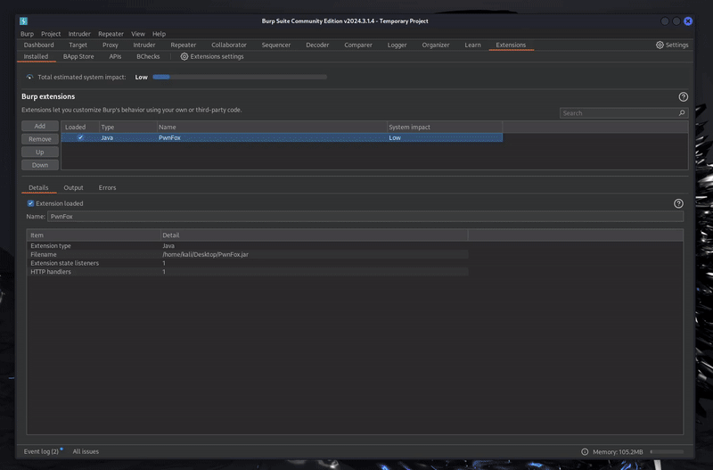
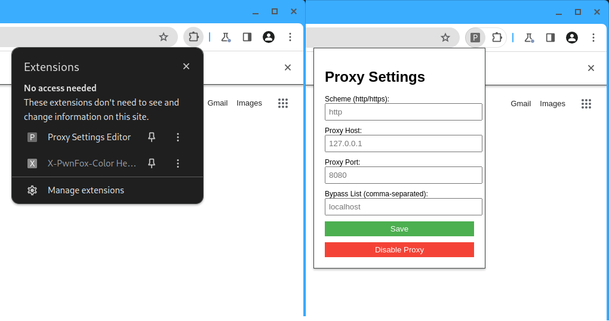

# PwnFox For Chromium
PwnFox For Chromium is a combination of a BurpSuite and browser addons that bootstrap your Chromium to work with the popular [PwnFox](https://github.com/yeswehack/PwnFox) BurpSuite extension.
PwnFox For Chromium allows you to:
- Set up Chromium to fully work with BurpSuite's proxy in a couple of clicks
- Launch Chromium directly from BurpSuite 
- Manage 8 separate Chromium user profiles for the ease of multi-account testing
- Clearly distinguish between user profiles through unique Chromium themes and color-coded HTTP traffic in the Proxy tab
- Extension settings persist between different sessions and only have to be configured once
- Works on Unix, MacOS and Windows



## Setup
0. Install the main [PwnFox](https://github.com/yeswehack/PwnFox) extension for Burp
1. Download the up-to-date `PwnFox-For-Chromium.jar` and `browser-extensions.zip` from the [Releases](https://github.com/adeadfed/PwnFox-For-Chromium/releases) tab
2. Extract `browser-extensions.zip` to a folder, e.g. `~/tools/PwnFox-For-Chromium/browser-extensions`
3. Import the PwnFox For Chromium JAR into the BurpSuite
4. Navigate to the new extension tab and configure the settings below
   - Set the Chromium path to a valid executable. BurpSuite is shipped with an embedded Chromium in the `burpbrowser` folder (e.g. `~/BurpSuitePro/burpbrowser` for the default installation on Unix)
   - Set the Chromium extensions directory to the one from step 2
   - *Optionally* set your desired profile data directory to keep your work on different projects separated 
5. Launch the configured Chromium right from the BurpSuite and enjoy!

## Compiling the extension on your own with Maven
```
git clone https://github.com/adeadfed/PwnFox-For-Chromium
cd PwnFox-For-Chromium/burp
mvn clean compile assembly:single
ls -l target/PwnFox-For-Chromium*.jar
```

## Proxy configuration
You can edit Chromium proxy configuration and enable/disable it using the built-in Proxy Settings Editor Chromium extension


## Why this instead of [autochrome](https://github.com/nccgroup/autochrome)?
- You don't need to download a separate Chromium browser for this extension. You can reuse the already existing Chrome/Chromium installation on your PC, or, even better, use the Chromium bundled with BurpSuite!
- The traffic will be color-coded in the Proxy tab by the [PwnFox](https://github.com/yeswehack/PwnFox) BurpSuite plugin
- All extension settings can be managed in BurpSuite directly
- Additional options for proxy configuration in the bundled Chromium extensions
- You can keep unique Chromium data for each engagement by separating the Chromium profile data directories
